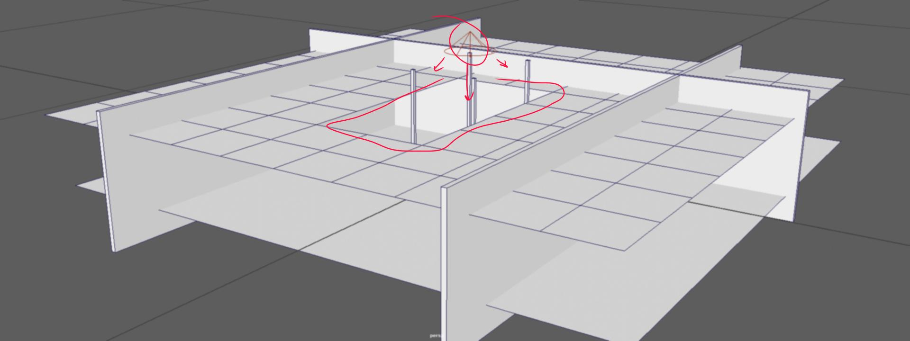

# The Importance of Earnest Lighting

By Moses Eribo

## Study 1: Interior

Setup:
Maya 2017 using the Mental Ray Renderer 

In this discussion I'll go over a powerful yet simple lighting setup for interiors. This setup is simply inspired from **Yone Santana's** *"Maya 2016 - Interior Lighting"* tutorial on youtube which refers to **Jeremy Vickery's** tutorial on *thegnomonworkshop*. I will however be condensing provided, to be more concise and approachable for quick applications

At the point of reading this, it's assumed we have a fair understanding of lighting basics, and how to light simple objects. 

The first stage of the the interior lighting setup is simple, using any method we create a room and add lights... That's it.

*As a note, creating a room contained in a box mesh will do just fine, this setup is a rework of an open design, there previously were no walls flaking neither was there a roof, the walls and roof were added for the purpose of the light experiment.*

Using a point light, we are imitating sunlight coming through a ceiling window.  A point light is used for better control, such as cone angle, which I increased giving the light cone more spread

